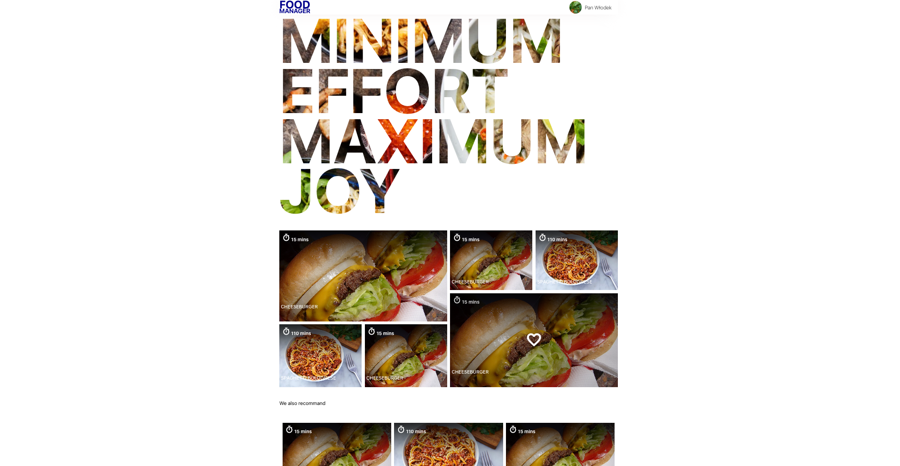

# Welcome!
This is FoodManager app that is simply Cookbook now, but its server and client side are a bit advanced. Here you can find Flask, JWT, MongoDB, React, GraphQL, Redux Toolkit, simple cookies,cropped images, Axios etc.. This first phase is to show how things can be combined. Next phase will be much more than a cookbook.

## Technologies
Project is created with:
* Python 3.11
* Node.js 21.1.0
* React 18.2.0 (on Vite)


## App Installation
To run this project, your machine should have Python3 and Node.js. 
Please install the app using npm:
```
$ npm install
$ npm run build-api
$ npm run start
```

When everything is going to be fine after installation and first start, you should visit "http://localhost:5173/" because there you can find the app. 

The whole main page of the app should look something like this



## User experience

Feel free to try it. You can sign up (you can use fake data, there is no validation via email message) and create your own profile by adding profile image or typing description. You can try also two versions of modals poping up when select recipe. 


